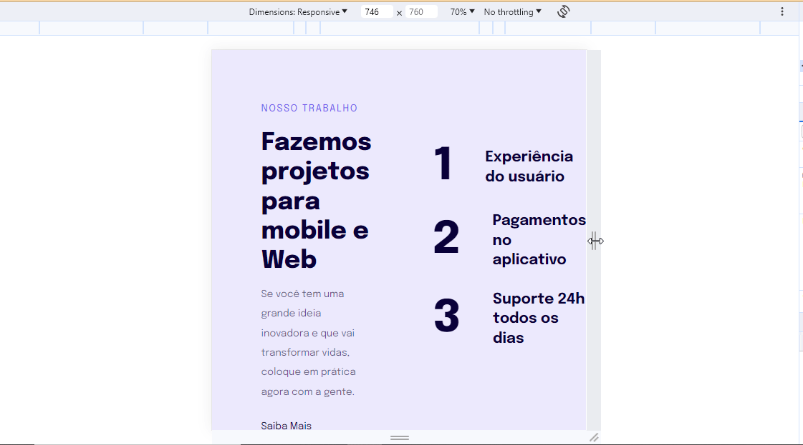

<h1 align="center"> Design Responsivo </h1>

Projeto guiado pela plataforma Rocketseat. Programa exclusivo para ensino de tecnologias WEB.

 

## Autores

- [@isisgoncalves](https://www.github.com/isisgoncalves)

## Referência

 - [Rocketseat](https://www.rocketseat.com.br)
 - [Mayk Brito](https://github.com/maykbrito)
 - [ReadMe](https://readme.so/pt)

## 🚀 Tecnologias

Esse projeto foi desenvolvido com as seguintes tecnologias:

- HTML
- CSS
- Figma
- Git e Github

## 💻 Projeto

Este é o quarto projeto acompanhando a plataforma de estudos Rocketseat, a qual introduzimos o conceito de responsividade ao design.

- [Acesse o projeto finalizado, online.](https://isisgoncalves.github.io/design_responsivo/)
